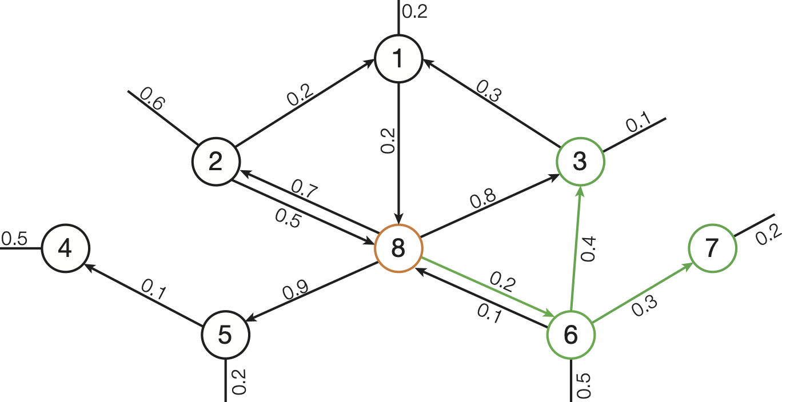

# FDE Bonus Project 3 - K Nearest Neighbors

#### Reminder

Use Linux as operating system to work on this task. We cannot provide support for any Windows or macOs related problems.

---
## Problem Description

In this project we work on a directed graph and implement an algorithm to find the _K Nearest Neighbors (knn)_ of a start node.

Each edge of the directed graph has a weight.
The K Nearest Neighbors are the `k nodes` (`result nodes`) with the cheapest path from `start node` to `result node`.
The cost of a path is the sum of all edges of the path.
The cheapest path is the one with the lowest cost.

---

**Figure 1:** *3-Nearest Neighbors search on a directed graph with start node 8. The result nodes are highlighted in green.*
---

For our example in **Figure 1** the 3-Nearest-Neighbors of `start node 8` are the result nodes: `(node: 6, cost: 0.2)`, `(node: 7, cost: 0.5)`, `(node 3, cost: 0.6)`.

For this project we are only interested in the K Nearest Neighbor nodes and the cost of their path as shown in the example result.
You do not need to keep track of the nodes on the path itself.

Please make sure your K Nearest Neighbors result:
- contains the weight of the cheapest paths from start node to each result node 
- contains no result node twice

---
## Your Task

Implement an efficient **K Nearest Neighbors** algorithm for a directed graph in the function **_getKNN()_**
in `include/KNN.hpp`. All solutions that compute correct results and achieve a time measurement better than **2
minutes** on the leaderboard will be accepted for the bonus. It is sufficient to implement a single-thead solution, you
do not need any parallelization.

Your implementation of `getKNN()` should return the K Nearest Neighbors as a vector of `Matrix::Entries`, where each Entry
consists of `column = the result node` and `weight = cost of the cheapest path from start node to this result node`.

### Code base & dataset

You only need to implement the *K Nearest Neighbors* algorithm itself in the function **_getKNN()_**. We provide you the
functions to read the graph file and create a matrix in ```include/Matrix.hpp```.  
The file also contains a description of the matrix structure and the dataset format. However, the only function of the
matrix you will need is ```getNeighbors()```.

#### Testing your solution

We provide you a smaller, but sufficient dataset (*~50MB*) in ```test/data/dataSmall.mtx``` to test your implementation,
a test suit ```test/data/GraphTests.cpp``` and a function for developmental and experimental use ```src/ForTesting```
(you probably won't need it).

You can run the test suit executing ```test_all```. To execute ```forTesting``` you have to provide the correct program
arguments: [CLion Tutorial](https://www.jetbrains.com/help/objc/add-environment-variables-and-program-arguments.html#add-program-arguments)
. The binary takes three arguments: <br>
```forTesting <absolute path> <start node> <k = number of nearest neighbors>``` <br>
Please provide the absolute file path and make sure it does not contain whitespaces. We provide an example in the
file ```src/ForTesting.cpp```.

Also, feel free to add tests if needed!

### Leaderboard benchmark

For the leaderboard measurement we will run the binary compiled from `BenchmarkLeaderboard.cpp` (CMake binary `bench`)
for four queries with different *start nodes* and *k* nearest neighbors. The used dataset (*500MB*) has *400000* nodes
with an average number of *50* outgoing edges per node. The overall runtime from start to end is measured.<br>

We use the same machine as for the previous projects: <br>
```Intel(R) Core(TM) i7-4770K CPU @ 3.50GHz with 4 cores, 8 hyperthreads and 32GB of memory.```

**Important:** Remove all prints on `cout` before uploading onto the server, because we use `cout` to collect the
results of the four different queries. If you don't remove them, you will receive the
output `"what():  Your result was wrong."` (which is identical to a real wrong result).

### Build

A configuration file is provided to build this project with CMake. This allows you to build the project
in the terminal but also provides the option to use Jetbrains CLion or Microsoft Visual Studio and other
IDEs.

Building from Terminal:
Start in the project directory.

```
mkdir -p build/debug
cd build/debug
cmake -DCMAKE_BUILD_TYPE=Debug ../..
make
```

This creates the binaries `test_all`, `bench` and `forTesting`.

---
## Submit
1. Change Teamname, Realname and MatrNr in `team.txt`.
   The Teamname will be displayed publicly on the leaderboard.
   You can choose an arbitrary name for this, but you are also welcome to use your real name.
   The Realname and MatrNr will be used later to verify your submission for the grade bonus.
2. Implement the task.
3. Commit your changes in git and push to the gitlab repository.
4. The build system will pick up your changes and evaluate the submission.
   If all tests succeed, your binary is handed over to the performance measurement harness.
   The resulting times will be entered into the leaderboard.
5. Visit http://contest.db.in.tum.de/ to see your result.

Make sure your builds are not failing! <br/>
*Left Sidebar > CI /CD > Pipelines*


## Hints

- Take care of cycles in the graph.
- What happens if you see a node again, can it be cheaper?
- Make sure the *K Nearest Neighbors* do not contain nodes twice. They should only contain the k cheapest neighboring
  nodes with their minimum costs from the start node.
- To get below 2 minutes you need to make your algorithm efficient and only process relevant nodes. Are there ways to
  rule out nodes? When can you stop? ;) Which data structures are efficient? You are allowed to write the data
  structures yourself or use existing ones from the standard library.
- Feel free to add files and additional classes if needed. However, you won't need it to solve this project.

## Debugging

If you fail a test you might want to use CLion's **conditional breakpoints** to investigate the cause. For example when
you fail the fourth test of `test_all` and your third node is not `1666237`, you can check what happens with the node
using conditional breakpoints. Therefore, you can e.g. set a breakpoint when handling a node with column `1666237` by
setting the `Condition:` `<variable_name_you_use>.column==1666237`. Jetbrains explains the use of breakpoints in
CLion [here](https://www.jetbrains.com/help/clion/using-breakpoints.html#set-breakpoints).

